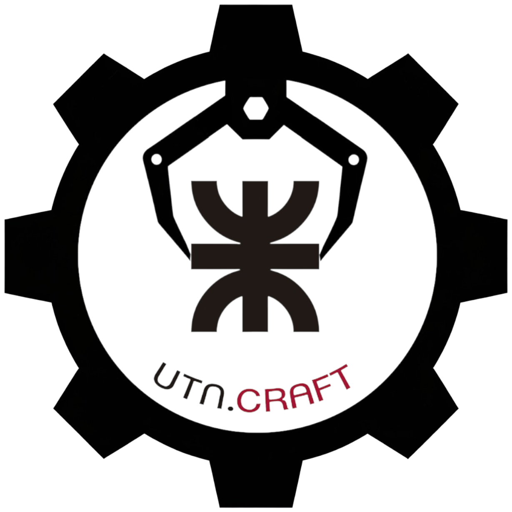
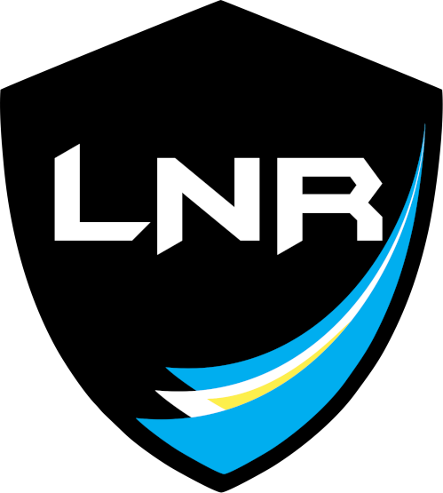

<h1 align="center">
  
   
  UTN-CRAFT
</h1>

Club de Robótica de la <b>Universidad Tecnológica Nacional Buenos Aires (UTN.BA)</b>
 
Construimos robots, aprendemos ingeniería y competimos en la 
<b><a href="https://lnr-argentina.com.ar/">Liga Nacional de Robótica (LNR)</a></b>.

<a href="https://www.instagram.com/utn.craft/">Instagram</a> •
<a href="https://beacons.ai/utn.craft">Links</a>

---

<h1>
 
Sobre UTN-CRAFT
</h1>

UTN-CRAFT es un club de robótica creado por estudiantes de la **UTN FRBA** con el objetivo de:

- diseñar robots de competencia  
- aprender robótica, electrónica y programación  
- desarrollar proyectos de ingeniería  
- representar a la facultad en competencias nacionales  

Trabajamos de forma colaborativa combinando **software, electrónica y mecánica** para construir robots competitivos.

---

# 🏁 Competencias

Participamos en la <b><a href="https://lnr-argentina.com.ar/">Liga Nacional de Robótica (LNR)</a></b> 

Las categorías incluyen:

- Sumo  
- Sumo RC  
- Mini Sumo  
- Micro Sumo  
- Carreras (velocistas)  
- Carreras Pro (con turbina)  
- Fútbol  
- Laberinto  

---

# 🛠 Qué hacemos en el club

Dentro del club trabajamos en distintas áreas:

### ⚙ Mecánica
- diseño de chasis  
- impresión 3D  
- distribución de peso  

### 🔌 Electrónica
- sensores  
- drivers de motores  
- baterías  
- diseño de PCB  

### 💻 Programación
- control de robots  
- máquinas de estado  
- control proporcional  
- optimización para competencia  

---

# 📚 Aprendizaje

Para formar nuevos miembros del club estamos desarrollando contenido educativo:

- cursos internos de programación para robótica  
- fundamentos de electrónica aplicada  
- diseño de robots de competencia  
- documentación técnica  

La idea es que cualquier estudiante pueda empezar desde cero y aprender a construir robots.

---

# 🚀 Cómo sumarte

Si te interesa la robótica y querés participar del club:

1️⃣ Podes mendar mensajes por consultas al instagram del club, te respondemos al instante.  

2️⃣ Participá de las reuniones, los 1ros y 3er Sabado de cada mes desde las 12hs en Campus (avisamos en instagram si hay cambio de aula).  

3️⃣ Empezá a trabajar en los proyectos del equipo. 

No importa si estás empezando o si ya tenés experiencia.  
El club está abierto a estudiantes que quieran **aprender, construir y competir**.

---

# 🌐 Comunidad

Seguinos para enterarte de proyectos, avances y eventos.

📸 <a href="https://www.instagram.com/utn.craft/">Instagram</a>  

🔗 <a href="https://beacons.ai/utn.craft">Beacons</a>

---

<b>Construir • Programar • Competir</b>

